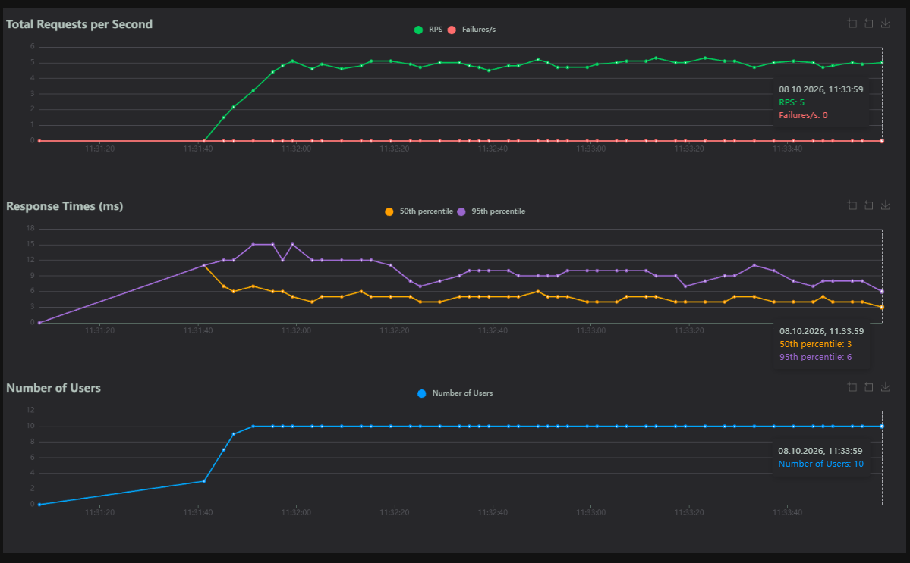
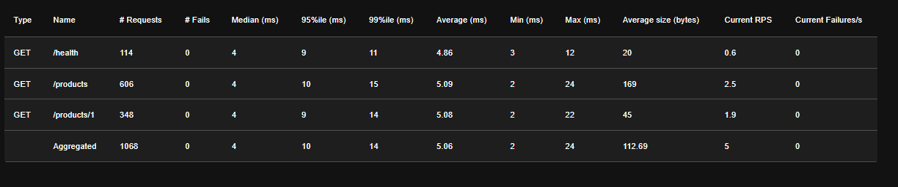
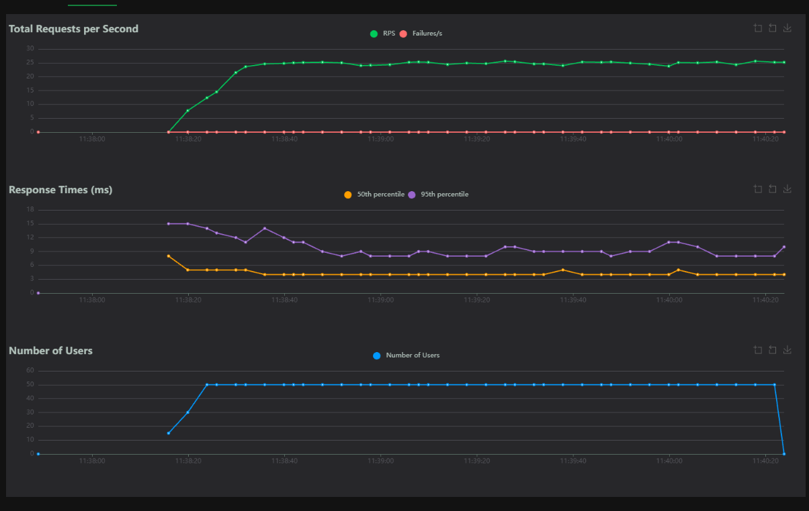
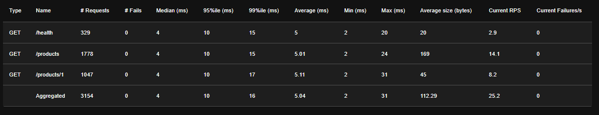
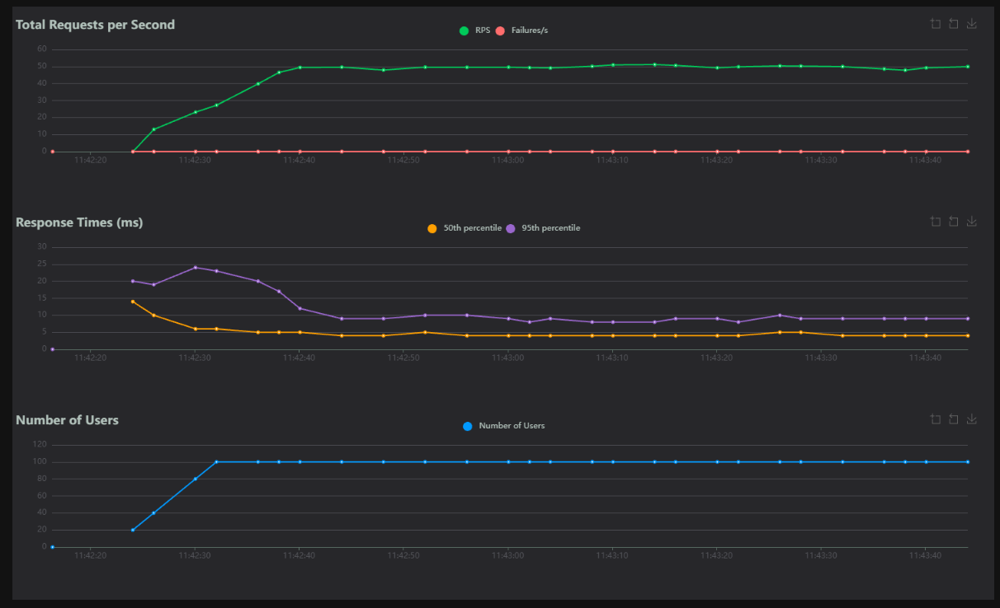
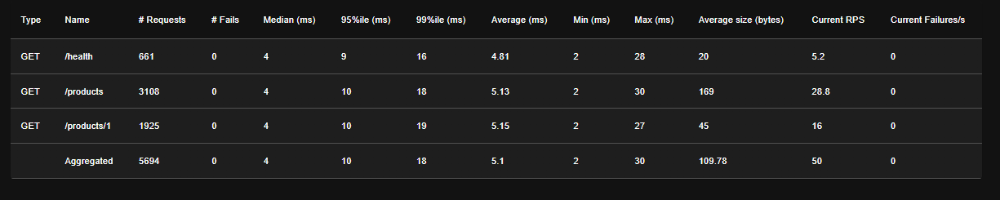
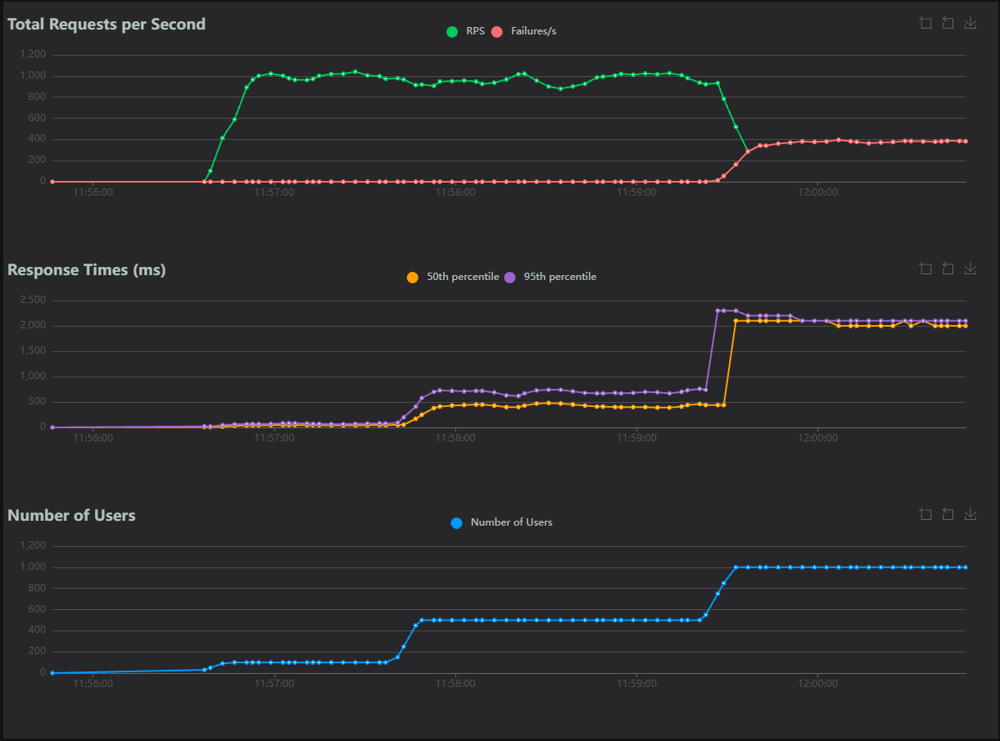
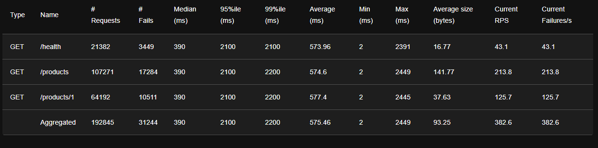

# Module 1
 
## 4.3
**1. 5.**
**2. Не деградирует до 100 пользователей.**
**3. p99.**
**4. Отсутствуют.**
 
## 4.4
Все эндпоинты отвечают одинаково (в среднем около 5 мс), различий нет.
 
# 5
## 1.
## Реализация
| Метод | Эндпоинт | Значение |
|---|---|---|
| GET | / | Возвращает информацию о сервисе, его статус и текущее время |
| GET | /health | Проверяет доступность и состояние сервиса |
| GET | /products | Возвращает список доступных товаров |
| GET | /products/{product_id} | Возвращает информацию о конкретном товаре по его ID |
 
## Технологии
 
Python — язык программирования;
FastAPI — создание REST API;
Uvicorn — запуск ASGI-приложения;
Locust — проведение нагрузочного тестирования;
HTTP/REST — взаимодействие с сервисом.
 
## 2 & 3.
 
| Тест | Users | Spawn Rate | RPS | p50 | p95 | p99 | Error rate | Avg | Duration |
|---|---|---|---|---|---|---|---|---|---|
| A | 10 | 1 | 5 | 4 | 10 | 14 | 0 | 5.06 | ≈2 мин |
| B | 50 | 5 | 25 | 4 | 10 | 16 | 0 | 5.04 | ≈2 мин |
| C | 100 | 10 | 50 | 4 | 10 | 18 | 0 | 5.1 | ≈1.5 мин |
 
# 4
 
## A

 
## B

 
## C

 
# 5
 
## Тест А
 
Пропускная способность увеличивается примерно до 5 RPS и стабилизируется через 10–15 секунд после старта.
В момент набора пользователей p95 достигает 15 мс, затем снижается до 6–10 мс. p50 держится около 4 мс.
Ошибки отсутствуют.
 
## Тест B
 
Пропускная способность увеличивается примерно до 25 RPS и стабилизируется после набора 50 пользователей.
В начале p95 достигает 15 мс, затем снижается до 8–10 мс. p50 около 4 мс.
Ошибки отсутствуют.
 
## Тест C
 
Пропускная способность стабилизируется на отметке около 50 RPS после достижения 100 пользователей.
В момент набора пользователей p95 достигает 24 мс, примерно через 20 секунд задержки возвращаются к 9–10 мс. p99 при этом немного выше, чем в предыдущих тестах (18 мс).
Ошибки отсутствуют.
 
# Saturation
 
В тестах A–C saturation не достигнут: RPS растёт линейно (около 0.5 RPS на одного пользователя), задержки и ошибки не растут.
 
Для поиска предела проведён тест без пауз (locustfile_stress.py), нагрузка ступенчато увеличивалась: 100, 500, 1000 пользователей.
 

 
| Пользователей | RPS | p50 | p95 | Ошибки |
|---|---|---|---|---|
| 100 | ≈1000 | десятки мс | ≈70 мс | нет |
| 500 | ≈950–1000 | ≈400 мс | ≈700 мс | нет |
| 1000 | падает, ≈380 ошибок/с | ≈2100 мс | ≈2100 мс | да |
 
При 100 пользователях сервис обрабатывает около 1000 запросов в секунду. При увеличении до 500 пользователей RPS не растёт, а задержки увеличиваются примерно в 10 раз: это точка saturation. При 1000 пользователей система перестаёт справляться: успешный RPS падает, задержки достигают 2 секунд, появляются ошибки. Всего за тест выполнено 192 845 запросов, из них 31 244 завершились ошибкой (около 16 %).
 
 
# 6
[Repository]
https://github.com/shinichi234-work/-Designing-data-intensive-services/