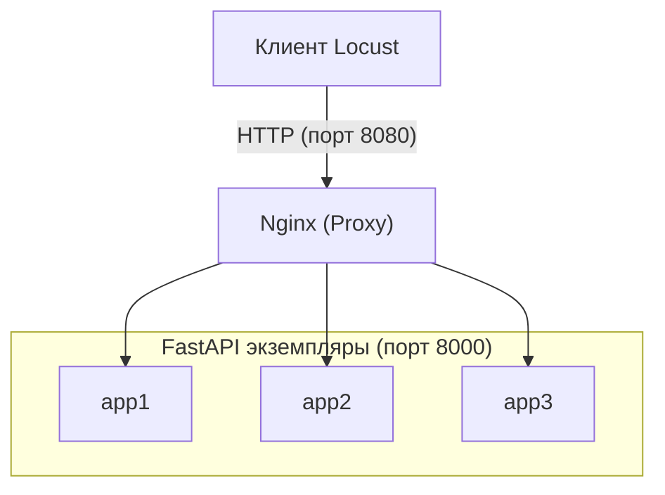

# 1



# 2

## Dockerfile
```dockerfile
FROM python:3.12-slim

WORKDIR /app

COPY requirements.txt .
RUN pip install --no-cache-dir -r requirements.txt

COPY main.py .

EXPOSE 8000

CMD ["uvicorn", "main:app", "--host", "0.0.0.0", "--port", "8000"]
```

## docker-compose.yml
```yaml
services:

  app1:
    build: .
    container_name: app1
    environment:
      - INSTANCE_NAME=app1
    networks:
      - highload-net

  app2:
    build: .
    container_name: app2
    environment:
      - INSTANCE_NAME=app2
    networks:
      - highload-net

  app3:
    build: .
    container_name: app3
    environment:
      - INSTANCE_NAME=app3
    networks:
      - highload-net

  nginx:
    image: nginx:1.27-alpine
    container_name: nginx-lb
    ports:
      - "8080:80"
    volumes:
      - ./nginx.conf:/etc/nginx/nginx.conf:ro
    depends_on:
      - app1
      - app2
      - app3
    networks:
      - highload-net

networks:
  highload-net:
    driver: bridge
```

## nginx.conf
```nginx
worker_processes auto;

events {
    worker_connections 1024;
}

http {
    include /etc/nginx/mime.types;
    default_type application/octet-stream;

    log_format upstream_log '$remote_addr - $upstream_addr - '
                           '"$request" $status $body_bytes_sent '
                           '"$http_referer" "$http_user_agent"';

    access_log /var/log/nginx/access.log upstream_log;

    upstream fastapi_backend {
        zone fastapi_backend 64k;

        least_conn;

        server app1:8000 max_fails=3 fail_timeout=30s;
        server app2:8000 max_fails=3 fail_timeout=30s;
        server app3:8000 max_fails=3 fail_timeout=30s;

        keepalive 32;
    }

    server {
        listen 80;
        server_name localhost;

        location / {
            proxy_pass http://fastapi_backend;

            proxy_http_version 1.1;
            proxy_set_header Connection "";

            proxy_set_header Host $host;
            proxy_set_header X-Real-IP $remote_addr;
            proxy_set_header X-Forwarded-For $proxy_add_x_forwarded_for;
            proxy_set_header X-Forwarded-Proto $scheme;

            proxy_connect_timeout 5s;
            proxy_send_timeout 30s;
            proxy_read_timeout 30s;

            proxy_next_upstream error timeout http_500 http_502 http_503 http_504;
            proxy_next_upstream_tries 2;
        }

        location /nginx-health {
            default_type text/plain;
            return 200 "OK\n";
        }
    }
}
```

# 3

```
"instance":"app1"
"instance":"app2"
"instance":"app3"
"instance":"app1"
"instance":"app2"
"instance":"app3"
```

## Вывод
Запросы идут по очереди на app1, app2 и app3. Без `zone` в `upstream` все запросы шли на app1, так как у Nginx несколько рабочих процессов и каждый считает отдельно. С `least_conn` порядок при запросах по одному такой же, разница видна только под нагрузкой.

# 4

Остановил контейнер: `docker compose stop app2`

```
app3
app3
app1
app3
app1
app3
```

app2 пропал из ответов, ошибок у клиента не было. После `docker compose start app2` он снова отвечает.

# 5

| Метрика | Работа №1 (напрямую) | Работа №2 (через Nginx) |
|---|---|---|
| RPS при 10 пользователях | 5 | 5 |
| RPS при 50 пользователях | 25 | 25 |
| RPS при 100 пользователях | 50 | 50 |
| p95 latency | 10 - 10 - 10 | 14 - 14 - 20 |

Тест без пауз:

| Пользователей | RPS напрямую | RPS через Nginx | Ошибки напрямую | Ошибки через Nginx |
|---|---|---|---|---|
| 100 | ≈1000 | ≈1250 | нет | нет |
| 500 | ≈1000 | ≈1100 | нет | нет |
| 1000 | падает | ≈1100 | ≈16 % | нет |

С обычным сценарием RPS не изменился, так как его ограничивают паузы между запросами. Задержки с Nginx выше на несколько мс из-за дополнительного звена. Без пауз прирост около 25 %, не втрое: всё работает на одном компьютере. При 1000 пользователей ошибки исчезли.

# 6

Nginx распределяет запросы между app1, app2 и app3 по очереди. При остановке одного контейнера пользователь не получил ошибок, трафик пошёл на оставшиеся. Пропускная способность выросла примерно на 25 %, при высокой нагрузке пропали ошибки.